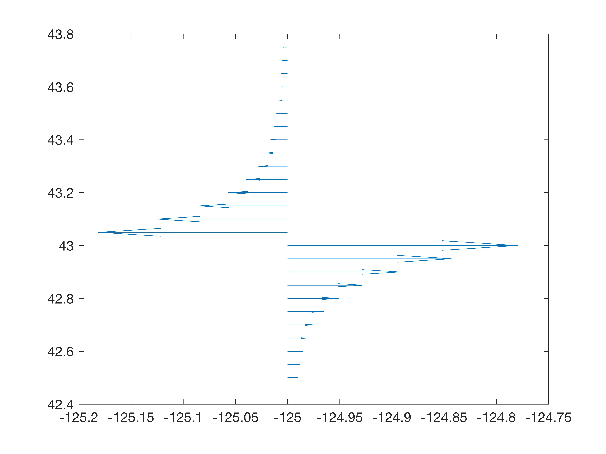

# simpleokada
A simple Okada forward modeling package in Python

The only things you need to change are the upper lines in okada_simple to match whatever source properties you want 
and the station file, here is sites.txt.

If all these scripts are in a single folder, just type

> python3 okada_simple.py

and the output will be to output.txt, the columns of which are lon, lat, north, east, up

If you run it out of the box, you should get a displacement profile that looks like

